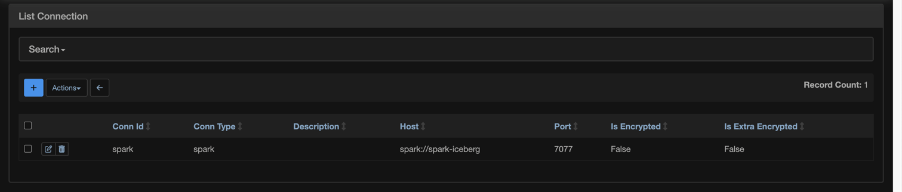
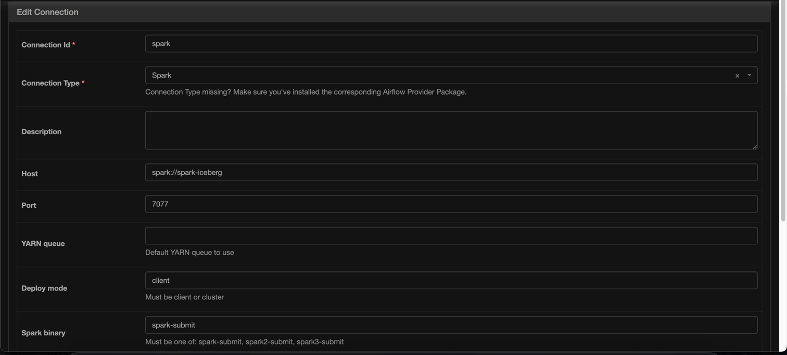

# How-to

## MongoDB

Use the following command to connect to the MongoDB container:

`docker exec -it mongodb-1 mongosh`

Run this to check the contents
```
use default

var collections = db.getCollectionNames();
for(var i = 0; i< collections.length; i++){    
   print('Collection: ' + collections[i]); // print the name of each collection
   db.getCollection(collections[i]).find().forEach(printjson); //and then print the json of each of its elements
}
```

Use this to wipe the contents of the collection
```
db.getCollection('aggregates').deleteMany({})
```

## Spark

Configure the Spark connection in the UI from `Admin` -> `Connections` -> `Add new record`


